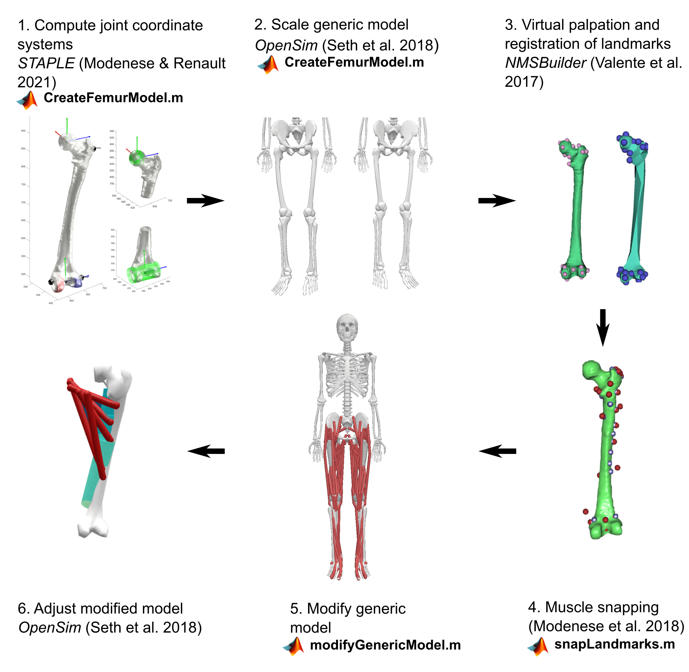

# Subject-Specific Femur Model Modification Material

This folder contains the custom scripts and support files used to create a subject-specific femur modification of the LaiUhlrich2022 OpenSim model. The workflow combines functionality from STAPLE/Modenese-style bone morphology processing, NMSBuilder landmark snapping, and OpenSim model editing.

The overall model modification process is illustrated here:



## Folder Contents

```text
MATLAB functions/
  createFemurModel.m
  extractFemurPathPoints.m
  modifyOsimModel.m

NMSBuilder/
  femurModel/
  LaiUhlrich2022_withLandmarks/
  NMSBuilderRajagopal_LaiUhlrich2022_femur_r_landmarks_and_muscle_path_points.txt
  NMSBuilderRajagopal_LaiUhlrich2022_femur_l_landmarks_and_muscle_path_points.txt
  Muscles_femur_r_snapped.txt
  Muscles_femur_l_snapped.txt

OpenSim/
  LaiUhlrich2022.osim
  LaiUhlrich2022_adjusted.osim
  LaiUhlrich2022_markers_augmenter.xml
  LaiUhlrich2022_markers_augmenter_adjusted.xml
```

## Required Software

To run the scripts, users need:

- MATLAB, tested with the OpenSim MATLAB API available.
- OpenSim 4.x with the MATLAB scripting interface configured.
- The STAPLE toolbox on the MATLAB path.
- NMSBuilder, if the landmark snapping step should be reproduced or modified.

STAPLE itself requires MATLAB toolboxes used by its morphology algorithms, especially:

- Curve Fitting Toolbox
- Statistics and Machine Learning Toolbox

The MATLAB OpenSim API must work before running the scripts. A quick test in MATLAB is:

```matlab
import org.opensim.modeling.*
model = Model('OpenSim/LaiUhlrich2022.osim');
```

## External Method Dependencies

The custom workflow builds on:

- STAPLE: Shared Tools for Automatic Personalised Lower Extremity modelling.
- Modenese et al. lower-limb model generation concepts and joint definitions.
- GIBOC-core functions bundled with STAPLE for femur morphology processing.
- OpenSim ScaleTool and model-editing API.
- NMSBuilder for manually snapping muscle path points and wrap-object origins to the personalized femur geometry.

These scripts do not replace STAPLE or NMSBuilder. They are glue scripts that use their outputs to modify a LaiUhlrich-style OpenSim model.

## Expected Input Data

The workflow assumes that subject-specific femur geometries are available in a STAPLE-compatible structure, for example:

```text
bone_datasets/
  VISIBLE_H/
    tri/
      femur_r.mat
      femur_l.mat
```

The femur geometry coordinates are assumed to be in millimetres. OpenSim model coordinates are in metres, so the model modification script uses:

```matlab
mm_to_m = 0.001;
```

The OpenSim model is assumed to use LaiUhlrich/Rajagopal-style names, including:

```text
Bodies:
  femur_r
  femur_l

Joints:
  hip_r, hip_l
  walker_knee_r, walker_knee_l
  patellofemoral_r, patellofemoral_l

Marker set:
  LaiUhlrich2022_markers_augmenter.xml
```

Muscle and wrap-object names in the snapped landmark files must match the names in the OpenSim model.

## Workflow Overview

### 1. Create femur coordinate systems and femur scale factors

Run:

```matlab
MATLAB functions/createFemurModel.m
```

This script:

- adds `STAPLE` to the MATLAB path,
- loads subject-specific femur triangulations,
- processes right and left femur geometries,
- computes STAPLE joint coordinate systems,
- exports reduced femur visualization geometry,
- saves femur coordinate-system data,
- computes right and left uniform femur scale factors,
- scales the generic LaiUhlrich2022 model femurs using OpenSim ScaleTool.

Important outputs include:

```text
opensim_models_JBiomech/
  automatic_VISIBLE_H_R.osim
  automatic_VISIBLE_H_L.osim
  automatic_VISIBLE_H_R_Geometries/
  automatic_VISIBLE_H_L_Geometries/
  fitted_geometries/VISIBLE_H/
    STAPLE_femur_coordinate_systems_r.mat
    STAPLE_femur_coordinate_systems_l.mat
    Femur_uniform_scaling_factor_r.txt
    Femur_uniform_scaling_factor_l.txt
```

### 2. Extract model landmarks for NMSBuilder

Run:

```matlab
MATLAB functions/extractFemurPathPoints.m
```

This script extracts:

- femur muscle path points,
- femur wrap-object origins,
- landmark rows required for NMSBuilder.

It writes combined text files for the right and left femur:

```text
NMSBuilderRajagopal_LaiUhlrich2022_femur_r_landmarks_and_muscle_path_points.txt
NMSBuilderRajagopal_LaiUhlrich2022_femur_l_landmarks_and_muscle_path_points.txt
```

These files can be imported into NMSBuilder together with the femur geometries.

### 3. Snap muscle and wrap landmarks in NMSBuilder

Use NMSBuilder to align/snap the exported muscle path points and wrap origins to the subject-specific femur geometry.

The expected snapped outputs are:

```text
NMSBuilder/Muscles_femur_r_snapped.txt
NMSBuilder/Muscles_femur_l_snapped.txt
```

Rows beginning with `O_` are treated as wrap-object origins. Other rows are treated as muscle path points. The names must match the OpenSim model.

### 4. Modify the scaled OpenSim model

Run:

```matlab
MATLAB functions/modifyOsimModel.m
```

This script:

- loads the scaled LaiUhlrich2022 OpenSim model,
- reads the snapped NMSBuilder landmark files,
- converts coordinates from mm to m,
- replaces femur muscle path point locations,
- replaces femur wrap-object origins,
- transforms femur wrap-object rotations using the updated femur offset frame,
- replaces the femur visualization meshes,
- applies `0.001` mesh scale factors,
- updates femur-side hip and walker-knee frames using saved STAPLE coordinate systems,
- updates the patellofemoral femur-side frame from the updated walker-knee frame,
- transforms femur mass-centre and inertia properties,
- updates femur marker locations in the marker set.

The main outputs are:

```text
OpenSim/LaiUhlrich2022_adjusted.osim
OpenSim/LaiUhlrich2022_markers_augmenter_adjusted.xml
```

## Coordinate and Unit Conventions

Several coordinate systems interact in this workflow:

- STAPLE femur coordinate systems are computed from the segmented femur geometry.
- NMSBuilder-snapped landmarks are exported in the geometry coordinate system.
- OpenSim body, joint, marker, muscle path, and wrap-object coordinates are stored in metres.
- The LaiUhlrich2022 model uses its own femur body-frame convention.

The modification script contains explicit transformations to move from the geometry/STAPLE convention into the OpenSim femur body frame. Users should not remove these transformations unless they also change the coordinate-system convention consistently.

## Paths Users Must Edit

The scripts currently contain absolute Windows paths from the original development machine. Before running them, edit the settings sections at the top of each script, especially:

```matlab
generic_osim_model_file
scaled_osim_model_file
snapped_landmark_folder
updated_osim_model_file
generic_marker_set_file
updated_marker_set_file
datasets_folder
output_models_folder
```

For a reusable GitHub repository, it is recommended to replace these absolute paths with paths relative to the repository root.

## Limitations

- The scripts are specific to right and left femurs.
- The OpenSim model must use compatible LaiUhlrich/Rajagopal naming.
- The workflow assumes the muscle and wrap-object names in the NMSBuilder text files match the OpenSim model exactly.
- NMSBuilder snapping is not automated by these MATLAB scripts.
- The model editing logic assumes femur geometry is stored in millimetres and OpenSim coordinates in metres.
- The scripts were developed for this thesis workflow and should be validated carefully before being reused for another subject or model.

## Recommended Citation / Acknowledgement

If using this material, cite the underlying tools and methods:

- Modenese L. and Renault J.-B., STAPLE / automatic generation of personalized lower-limb skeletal models.
- The STAPLE toolbox repository and documentation.
- OpenSim.
- The LaiUhlrich2022 / Rajagopal model sources, where applicable.

Also cite this repository or thesis material if these custom scripts are used directly.
